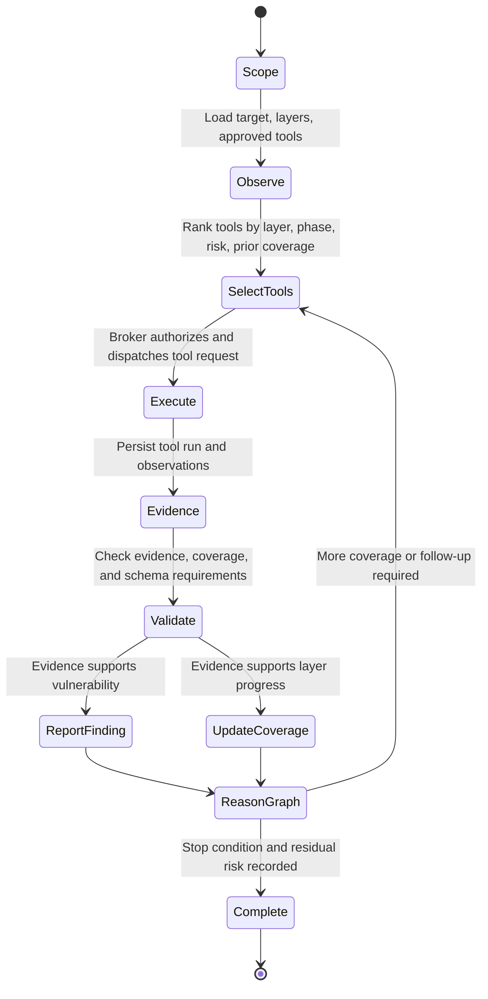
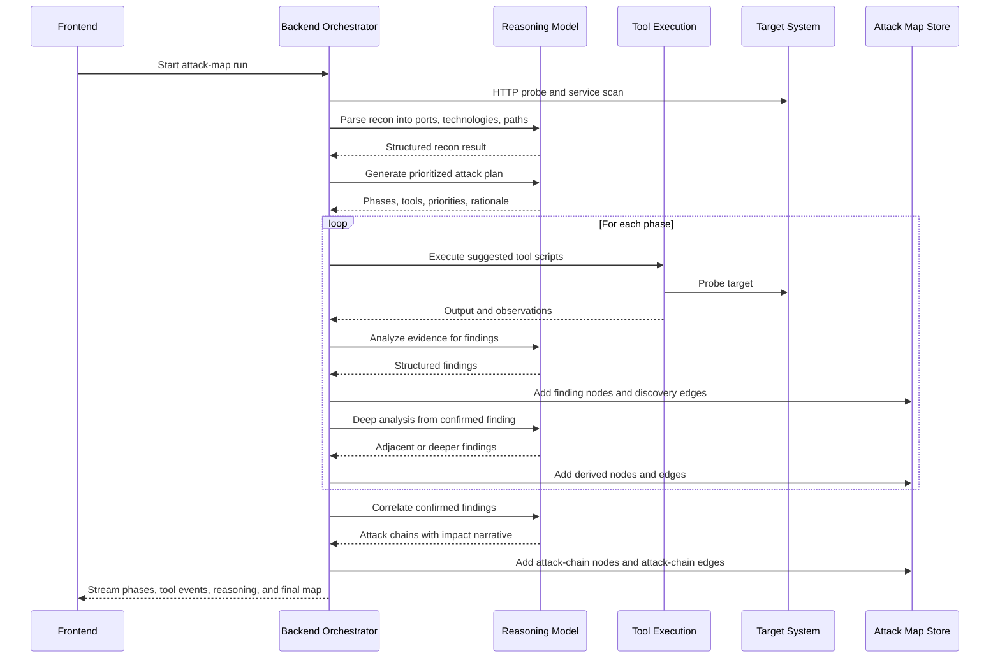
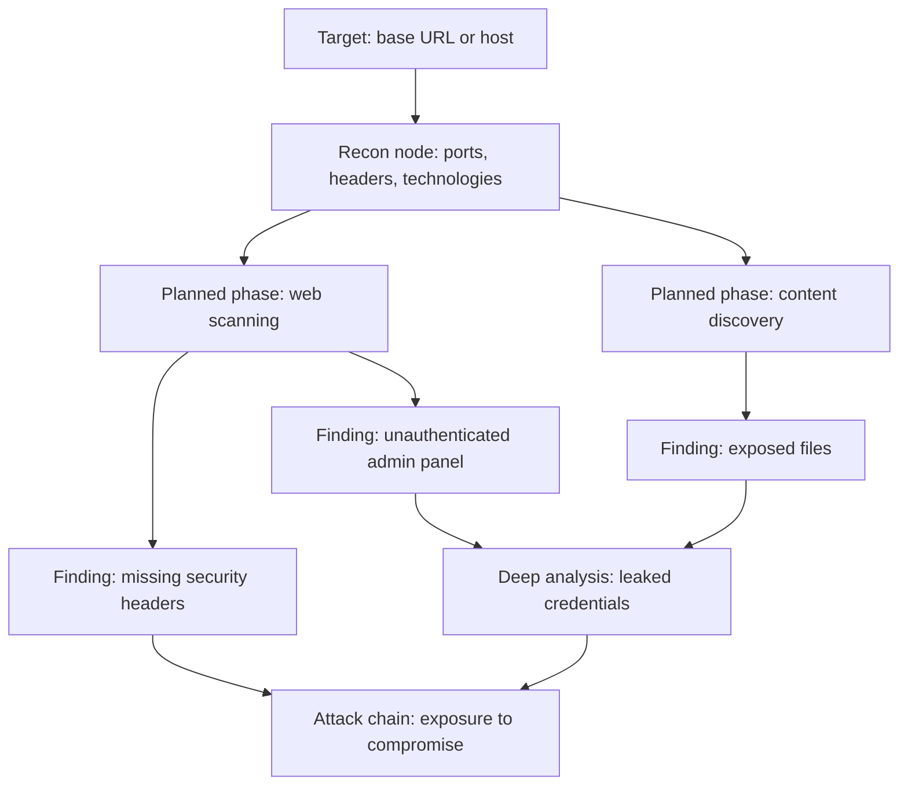
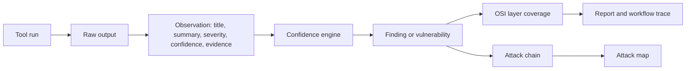
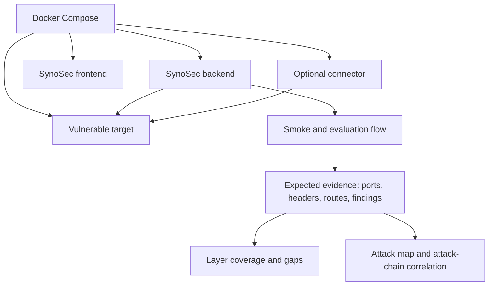

# SynoSec

SynoSec is an AI-assisted vulnerability discovery and security orchestration platform. It combines graph-reasoning agents, evidence-producing security tools, structured vulnerability reporting, and a built-in cyber range to identify weaknesses in a target system and explain how those weaknesses connect into practical attack paths.

The project is designed for authorized security testing, validation, and demonstrations. The included vulnerable target is intentionally insecure and must not be exposed to the public internet.


## Mission

SynoSec is built to reduce the gap between conventional scanner output and analyst-grade security reasoning. Instead of only reporting isolated tool findings, the platform records evidence, maps findings to system layers, correlates related weaknesses, and presents the result as an attack map that can be reviewed, reproduced, and improved.

The core objective is to answer four questions for a target system:

1. What reachable services, technologies, paths, and trust boundaries exist?
2. Which security weaknesses are supported by concrete tool evidence?
3. Which OSI layers were covered, partially covered, or not covered?
4. Which findings can be combined into higher-impact attack chains?

## System Architecture

SynoSec is organized as a distributed control plane with local or connector-based execution. The backend coordinates agents, providers, tool policies, tool execution, scan state, and attack-map persistence. The frontend presents workflow traces, tool results, coverage, and graph relationships.


### Main Components

- `apps/frontend`: React and Tailwind interface for targets, agents, tools, workflows, execution reports, and the attack map.
- `apps/backend`: Express API, scan orchestration, workflow execution, AI-provider integration, tool brokerage, scan storage, and attack-chain correlation.
- `apps/connector`: Worker process for executing tool jobs from a different network position than the backend.
- `packages/contracts`: Shared TypeScript contracts and Zod schemas for scans, vulnerabilities, OSI coverage, tool runs, observations, workflow events, reports, and attack chains.
- `scripts/tools`: Bash-backed tool implementations used by the broker and seeded AI-tool definitions.
- `demos/vulnerable-app`: Controlled vulnerable target used as the general cyber range for safe validation.
- `demos/full-stack-target`: Controlled full-stack target with UI, API, SQLite data, and two chained attack tracks.
- `demos/juice-shop`: Pinned OWASP Juice Shop container used as an additional maintained lab target for broad web testing.

## Vulnerability Discovery Method

SynoSec uses a closed-loop methodology: observe the target, reason over the current graph, choose evidence-producing tools, validate tool output, and update the graph. The system is intentionally evidence-oriented. A vulnerability is not just a model assertion; it must be represented as a structured record with target details, severity, confidence, technique, recommendation, and evidence references.



The current execution path is the attack-map orchestrator.

### Attack-Map Orchestrator

The attack-map path focuses on graph construction and relationship analysis. It performs initial reconnaissance, asks the model to build an attack plan, executes mapped tools for each phase, extracts findings, performs deep analysis from confirmed findings, and then correlates multi-finding attack chains.



## Graph-Reasoning Agents

SynoSec treats a scan as a reasoning graph rather than a flat list of scanner results. Graph nodes represent different node kinds such as targets, tactics, findings, and attack chains. Edges represent discovery relationships or attack-chain relationships. This allows the system to preserve how a result was reached, what evidence supports it, and how one weakness enables another.



Graph reasoning is used in three ways:

- Prioritization: The agent selects the next tool or phase based on current coverage, previously executed tools, observed services, and risk.
- Expansion: Confirmed findings become new reasoning anchors for deeper or adjacent checks, such as privilege escalation, lateral movement, or exposed secrets.
- Correlation: Multiple findings are evaluated together to identify attack chains that have higher impact than any individual finding.

The resulting attack map is not only a visualization layer. It is the working memory of the scan: a reviewable model of what was observed, what was inferred, and what relationships were established.

## Evidence and Validation Model

SynoSec separates raw tool execution from security conclusions. Tool output is converted into observations. Observations can become findings. Findings can become structured vulnerabilities or graph nodes. Chain analysis links findings only when there is a plausible enabling relationship.



Important validation properties:

- Tool requests are authorized by policy before execution.
- Tool runs record status, exit code, output, command preview, dispatch mode, and failure reason.
- Observations include a source tool, target, evidence, technique, confidence, and severity.
- Vulnerability submissions require evidence, impact, recommendation, target metadata, confidence, and validation status.
- Layer coverage records include tool references, evidence references, vulnerability references, and explicit gaps.
- Corroborating observations are aggregated by the confidence engine using `1 - (1 - A)(1 - B)`, which increases confidence when independent evidence supports the same hypothesis.

## Tool Selection and Execution

Tools are defined with category, risk tier, execution phase, OSI-layer metadata, tags, input schema, and script implementation. The selector ranks tools from the approved agent set using:

- Layer alignment with requested but uncovered OSI layers.
- Phase progression from early reconnaissance to late validation.
- Risk gating for passive, active, and controlled-exploit tools.
- Recency penalties so the loop does not repeatedly choose the same tool without new justification.
- Category diversity so selected tools do not collapse into one narrow class.

The broker then compiles the tool definition into a concrete request, checks policy, dispatches it locally or through a connector, stores the result, and emits workflow events. Tool failures are recorded with original failure context so operators can inspect what failed instead of receiving an artificial success.

## OSI-Layer Coverage

SynoSec models security coverage across `L1` through `L7`:

| Layer | Name | Example evidence in SynoSec |
| --- | --- | --- |
| `L1` | Physical | Simulated host-level leakage or mounted host artifacts in cyber range scenarios |
| `L2` | Data Link | Docker bridge or local-link exposure checks in controlled environments |
| `L3` | Network | Reachable hosts, segmentation gaps, ICMP behavior, network mapping |
| `L4` | Transport | Open ports, exposed services, plaintext transport, unexpected listeners |
| `L5` | Session | Token expiry, replay, session fixation, cookie or JWT lifecycle issues |
| `L6` | Presentation | Encoding, content type handling, weak cryptographic presentation, parser issues |
| `L7` | Application | Authentication bypass, injection, BOLA, XSS, exposed admin routes, sensitive data exposure |

Coverage is recorded as `covered`, `partially_covered`, or `not_covered`. A layer can remain partially covered when a tool produced useful evidence but the agent still reports gaps, uncertainty, blocked checks, or missing validation.

## Cyber Range Evaluation

The repository includes three safe local targets for controlled testing:

- `demos/vulnerable-app`: an intentionally vulnerable Express application with standalone web flaws such as SQL injection, exposed admin access, sensitive API data, directory listing, and reflected XSS.
- `demos/full-stack-target`: an intentionally vulnerable full-stack Express and SQLite application with browser workflows, JSON APIs, and two attack tracks that converge on the same finance export.
- `demos/juice-shop`: an OWASP-maintained intentionally insecure application, pinned to a specific Docker image tag for broad challenge coverage in the local cyber range and backed by a local target-pack snapshot for workflow evaluation.

The cyber range exists to evaluate whether agents can move from reconnaissance to evidence-backed conclusions and derived attack paths without touching a real third-party system.



Evaluation focuses on:

- Discovery accuracy: Whether open ports, services, headers, and known paths are detected.
- Evidence quality: Whether findings cite concrete output rather than unsupported model claims.
- Coverage quality: Whether each requested layer has an explicit status and gap statement.
- Graph quality: Whether related findings are connected into plausible discovery or attack-chain relationships.
- Failure transparency: Whether failed tools and incomplete checks remain visible in traces and reports.

## Data Flow

At runtime, a typical vulnerability discovery pass follows this path:

1. The analyst defines an application, runtime, agent, target scope, requested OSI layers, and exploit allowance.
2. The backend creates a scan and root graph node.
3. The tool selector ranks approved tools for the current layer coverage and scan phase.
4. The agent requests a tool or the orchestrator executes a planned phase.
5. The broker authorizes the request and dispatches it locally or through a connector.
6. Tool output is persisted as a tool run and normalized into observations.
7. The agent or orchestrator analyzes the evidence and submits vulnerabilities, coverage updates, or graph findings.
8. Confirmed findings are used as anchors for deeper reasoning and attack-chain correlation.
9. Reports, traces, coverage, and the attack map are exposed to the frontend.

## Getting Started

### Prerequisites

- Docker and Docker Compose
- Node.js 20 or newer
- `pnpm`
- Anthropic API key when `LLM_PROVIDER=anthropic`
- Optional local model runtime such as Ollama when `LLM_PROVIDER=local`

### Quick Start with Docker

```bash
cp .env.example .env
make docker-up
```

`make docker-up` follows the same destructive local database bootstrap as `make dev`: it starts the Docker Compose stack, resets persisted app data, and re-seeds the Prisma database before reporting the stack as ready.

### Local Development

```bash
pnpm install
make dev
```

Local development starts Postgres, all local demo targets, and the host-mode backend and frontend. Attack-map and scan execution should be started from the UI rather than as an automatic background action during development startup.

Workflow execution now uses one backend-wide runtime selected by `LLM_PROVIDER`. Use `anthropic` with `ANTHROPIC_API_KEY` for hosted execution, or `local` with `LLM_LOCAL_BASE_URL` and `LLM_LOCAL_MODEL` for Ollama over its OpenAI-compatible `/v1` interface. For Anthropic, set `CLAUDE_MODEL` to choose the exact Claude variant; `LLM_ANTHROPIC_MODEL` remains supported as a backward-compatible fallback. `LLM_LOCAL_OPENAI_API_MODE` controls which OpenAI-style API path is used for local inference; keep it on `chat` for Ollama workflow/tool compatibility unless you are intentionally testing the `responses` path. When `LOCAL_ENABLED=TRUE`, the Docker-backed development path can start Ollama and prepare the configured local model.

### Endpoints

| Service | Default URL |
| --- | --- |
| Frontend | `http://localhost:5173` |
| Backend API | `http://localhost:3001` |
| Vulnerable target | `http://localhost:8888` |
| Full-stack target | `http://localhost:8891` |
| Juice Shop target | `http://localhost:3000` |
| Ollama, when enabled | `http://localhost:11434` |

### Common Commands

```bash
make docker-up                # Start the Docker Compose stack and reseed the local database
make docker-down              # Stop and remove Docker services
make dev                      # Start host-mode development
make smoke-seeded-sandbox     # Run the seeded connector sandbox smoke validation
make test                     # Run workspace tests
pnpm build                    # Build all workspace packages
```

To fully stop local development services and free the default ports:

```bash
make docker-down
make free-dev-ports
```

### Authentication

Optional app-user authentication is controlled by `AUTH_ENABLED`. When it is enabled, configure the Google client ID, allowed emails, session secret, cookie settings, and frontend URL in `.env`. Google Identity Services redirect mode posts the returned ID token to `/api/auth/google`; the backend verifies the token, creates the SynoSec session cookie, and redirects the browser back into the application.

`AUTH_ALLOWED_EMAILS` is enforced on authenticated requests, so removing an address from the allowlist prevents continued access on the next session-backed call.

### Connector Execution

The connector path lets SynoSec execute broker-approved tool jobs from another network position. This is useful for VPS deployments, segmented test networks, or cyber range layouts where the backend should not execute probes directly.

Key settings:

- `TOOL_EXECUTION_MODE=connector` routes broker-approved tool runs through the connector control plane.
- `CONNECTOR_RUN_MODE` supports dry-run, simulation, and execution modes and now defaults to `execute` in the repo-managed dev and production stacks.
- Connectors now self-report installed binaries, and the backend derives exact supported seeded tool IDs before dispatch instead of relying on loose capability overlap.
- `CONNECTOR_DOCKER_TARGET` selects the connector image profile. Local Docker defaults to `connector-dev-web`; VPS/prod defaults to `connector-prod-full`.
- The connector image is now modular: `core`, `web`, `cloud`, `windows`, `forensics`, `reversing`, and `exploitation` layer on the same base runtime, while `full` preserves the prior all-tools shape.
- `POST /api/connectors/test-dispatch` can validate broker-to-connector dispatch without starting a full scan.

### Production Deployment

The production stack is defined in `docker-compose.vps.yml` and is intended to run behind host-level nginx. The VPS deployment model uses Dockerized backend, frontend, connector, and Postgres services, with nginx terminating TLS and forwarding traffic to loopback-bound frontend and backend ports.

GitHub Actions deploys to a VPS using `.github/workflows/deploy.yml` and the production stack in `docker-compose.vps.yml`.

- Host `nginx` runs directly on the VPS and proxies traffic to Dockerized frontend and backend services bound on loopback.
- `backend` runs the compiled API and destructively resets then re-seeds the Prisma database on startup.
- `frontend` runs the production frontend build behind the host nginx reverse proxy.
- `connector` stays on the private Docker network and polls the backend control plane.
- `postgres` persists app data in a named Docker volume.
- `CONNECTOR_DOCKER_TARGET=connector-prod-full` keeps the production stack on the compatibility image until you intentionally narrow it.

Before using the deploy workflow, define these GitHub repository variables:

- `VPS_HOST`
- `VPS_USER`
- `FRONTEND_URL`

Define these GitHub repository secrets as well:

- `VPS_SSH_KEY`
- `POSTGRES_PASSWORD`
- `ANTHROPIC_API_KEY`
- `CONNECTOR_SHARED_TOKEN`
- `AUTH_SESSION_SECRET`

Most non-secret application defaults now live in `infra/deploy/env.vps.template`, so GitHub only needs the host-specific variables above plus the runtime secrets. If you need to change default model, scan, connector, auth, or public port settings for every deployment, edit that committed template instead of adding more Actions variables.
The deploy workflow hardcodes the VPS app directory to `/opt/synosec` and binds the host loopback ports to `3030` for the frontend and `3031` for the backend.
The deploy user must already be able to create and write `${VPS_TARGET_DIR}` without `sudo`.
Production deploys no longer use `sudo` or `chown`.
Production backend startup now runs `prisma db push --force-reset` followed by `prisma db seed`, so every deploy is intentionally destructive and recreates the seeded database state from `apps/backend/prisma/schema.prisma` plus the seed scripts.

Set `FRONTEND_URL` to the public HTTPS origin: `https://synosecai.com`.

For Google Cloud Console production setup, use:

- `Authorized JavaScript origins`: `https://synosecai.com`
- `Authorized redirect URIs`: `https://synosecai.com/api/auth/google`

If production traffic can also land on `https://www.synosecai.com`, add both of these as well:

- `Authorized JavaScript origins`: `https://www.synosecai.com`
- `Authorized redirect URIs`: `https://www.synosecai.com/api/auth/google`

Routine GitHub Actions deploys do not modify host `nginx`. Keep the host reverse proxy as a separate operational concern and update it manually only when the public domain, TLS certificate layout, or loopback proxy ports change.

The canonical host nginx template lives at `infra/nginx/synosec.vps.conf.template`. It redirects HTTP to HTTPS, terminates TLS on the VPS using the standard Certbot layout under `/etc/letsencrypt/live/<server_name>/`, forwards the original client scheme and host to the app, and emits `Strict-Transport-Security`.

When you need to install or refresh that host config manually:

- set `SERVER_NAME` to the apex domain only, for example `synosecai.com`
- render the template with `SERVER_NAME`, `BACKEND_PUBLIC_PORT=3031`, and `FRONTEND_PUBLIC_PORT=3030`
- install it to your nginx site path using the privileges required on that VPS
- run `nginx -t` and reload nginx manually

Post-deploy health checks now run on the VPS origin loopback endpoints instead of the public domain, so deploy validation does not depend on Cloudflare edge behavior.

## Connector testing

The Docker stack now runs the same connector shape you can later deploy on a VPS.
Script-only seeded tool changes still use the bind-mounted repo in local dev, so they do not require a connector image rebuild. Adding a binary-backed tool now means rebuilding only the owning connector profile image instead of the full toolchain.

## Repository Structure

```text
apps/
  backend/       API, orchestration, agents, tools, scan services
  connector/     Remote or isolated tool execution worker
  frontend/      Dashboard, workflow traces, attack-map views
packages/
  contracts/     Shared schemas and types
scripts/
  tools/         Bash tool implementations
demos/
  vulnerable-app/ Controlled vulnerable target for evaluation
  full-stack-target/ Controlled full-stack target with two attack tracks
docs/
  *.md           Requirements, decisions, terminology, and feature notes
```

## Feature and Design Documentation

Additional project notes live under `docs/`:

- `docs/decisions.md`: Locked project decisions that should not be reopened casually.
- `docs/defensive-loop-contract.md`: Defensive-loop behavior and contracts.
- `docs/features.md`: Active feature inventory and extension guidance.
- `docs/strategy-flow-terminology.md`: Current product terminology for attack maps, graphs, nodes, tactics, and attack chains.
- `docs/vulnerable-app-specification.md`: Local cyber range targets and intended vulnerability coverage.

## Security and Usage Boundaries

SynoSec is for authorized security assessment and controlled cyber range evaluation. Do not point active or controlled-exploit tools at systems you do not own or have explicit permission to test. The demo vulnerable application is deliberately insecure and should only run in an isolated development or evaluation environment.

## Contributing Tools

New tool integrations should be added as auditable, policy-aware capabilities:

1. Define the tool metadata and OSI-layer mapping in the catalog or seed data.
2. Implement the script under `scripts/tools`.
3. Ensure the tool returns structured observations where possible.
4. Add or update tests for compilation, selection, and execution behavior.
5. Verify behavior against the cyber range before relying on it for demonstrations.

## Tool Platform Architecture

The tool platform is designed so the repo can grow from a small demo catalog to a larger evidence-collection surface without turning backend execution or seed data into a maintenance bottleneck.

The current model has four main pieces:

1. A modular catalog in `apps/backend/src/engine/tools/catalog/`
2. Seeded tool definitions in `apps/backend/prisma/seed-data/tools/`
3. Script implementations in `scripts/tools/`
4. Runtime surfaces in `apps/backend/src/modules/ai-tools/` and `apps/backend/src/engine/workflow/`

### Catalog And Capability Metadata

The canonical catalog lives under:

- `apps/backend/src/engine/tools/catalog/types.ts`
- `apps/backend/src/engine/tools/catalog/index.ts`
- `apps/backend/src/engine/tools/catalog/<domain>.ts`

Runtime capability inspection and duplicate-id validation live in:

- `apps/backend/src/engine/tools/tool-catalog.ts`

The catalog is split by domain such as `network`, `web`, `content`, `subdomain`, `dns`, `password`, `cloud`, `kubernetes`, `windows`, `forensics`, `reversing`, `exploitation`, and `utility`.

### Seeded Implementations

Concrete seeded tools are split across:

- Shell assets in `scripts/tools/<category>/<tool>.sh`
- Seed modules in `apps/backend/prisma/seed-data/tools/<category>/<tool>.ts`
- Seed assembly in `apps/backend/prisma/seed-data/ai-builder-defaults.ts`

This keeps executable logic in inspectable scripts while leaving the database seed layer responsible for metadata and registration.

### Runtime Surfaces

The main runtime entry points are:

- `apps/backend/src/modules/ai-tools/tool-runtime.ts`
- `apps/backend/src/modules/ai-tools/ai-tool-surface.ts`
- `apps/backend/src/engine/workflow/workflow-execution.service.ts`
- `apps/backend/src/engine/workflow/broker/tool-broker.ts`

The current backend also includes:

- semantic-family tool definitions in `apps/backend/src/modules/ai-tools/semantic-family-tools.ts`
- stage-owned workflow tool resolution in `apps/backend/src/modules/ai-tools/ai-tool-surface.ts`
- tool execution config handling in `apps/backend/src/modules/ai-tools/tool-execution-config.ts`

### Adding A New Tool

The steady-state workflow for adding a tool is:

1. Add a `ToolCatalogEntry` to the correct file in `apps/backend/src/engine/tools/catalog/`.
2. Add the implementation script in `scripts/tools/<category>/<tool-name>.sh`.
3. Add the seed module in `apps/backend/prisma/seed-data/tools/<category>/<tool-name>.ts`.
4. Import it into `apps/backend/prisma/seed-data/ai-builder-defaults.ts` and add it to `seededToolDefinitions`.
5. Run the seed upsert so the tool exists in the database.
6. Add or update tests for catalog exposure, compilation, and execution behavior.

## Developer Notes

### Where Tool Behavior Actually Comes From

There are three different layers to keep straight:

- Catalog metadata:
  `apps/backend/src/engine/tools/catalog/`
  This is capability metadata, installation checks, selection hints, and future assignment input.

- Seeded tool implementations:
  `scripts/tools/`
  `apps/backend/prisma/seed-data/tools/`
  These are the concrete built-in tools that get seeded into the database.

- Runtime execution config:
  Stored on the tool record and resolved through:
  `apps/backend/src/modules/ai-tools/tool-execution-config.ts`

If you change tool behavior, make sure you are editing the correct layer.

### Current Seeded Tool Set

SynoSec comes with a comprehensive set of built-in security tools categorized by domain:

- **Network**: `nmap`, `ncat`, `netcat`, `service-scan`
- **Web**: `nikto`, `sqlmap`, `http-recon`, `http-headers`, `sql-injection-check`, `vuln-audit`
- **Content Discovery**: `gobuster`, `dirb`, `ffuf`, `web-crawl`, `content-discovery`
- **Subdomain Enumeration**: `amass`, `sublist3r`
- **Exploitation**: `metasploit-framework`
- **Password Cracking**: `hashcat`
- **Forensics**: `steghide`
- **Windows Enumeration**: `enum4linux`
- **Utility**: `bash-probe`

These tools are pre-configured with bash scripts in `scripts/tools/` and seeded into the database for immediate use by workflow stages.

### Key Backend Files

- Workflow execution loop:
  `apps/backend/src/engine/workflow/workflow-execution.service.ts`
- Tool catalog entrypoint:
  `apps/backend/src/engine/tools/tool-catalog.ts`
- Workflow tool surface:
  `apps/backend/src/modules/ai-tools/ai-tool-surface.ts`
- Seed assembler:
  `apps/backend/prisma/seed-data/ai-builder-defaults.ts`

### Recommended Checks After Tool-Platform Changes

Backend:

- `pnpm --filter @synosec/backend exec tsc -p tsconfig.json --noEmit`
- targeted Vitest runs for the area you changed

Frontend:

- `pnpm --filter @synosec/frontend exec tsc -p tsconfig.json --noEmit`

If you touch seeded scripts or seed modules, also make sure startup validation still passes and that `pnpm --filter @synosec/backend build` succeeds.
