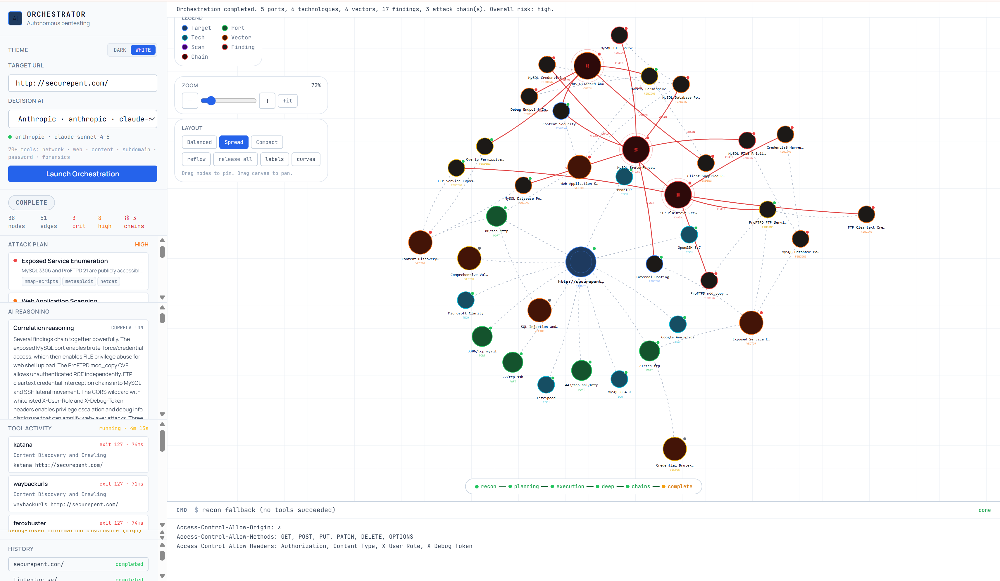
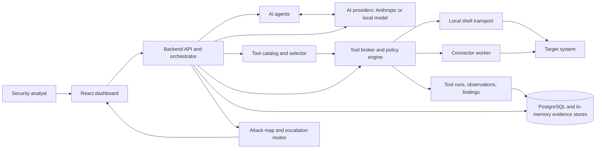
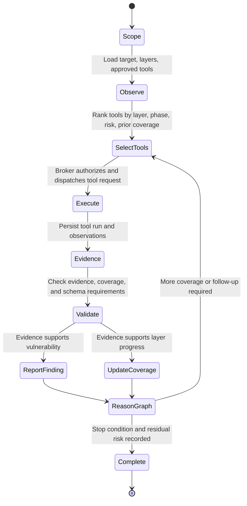
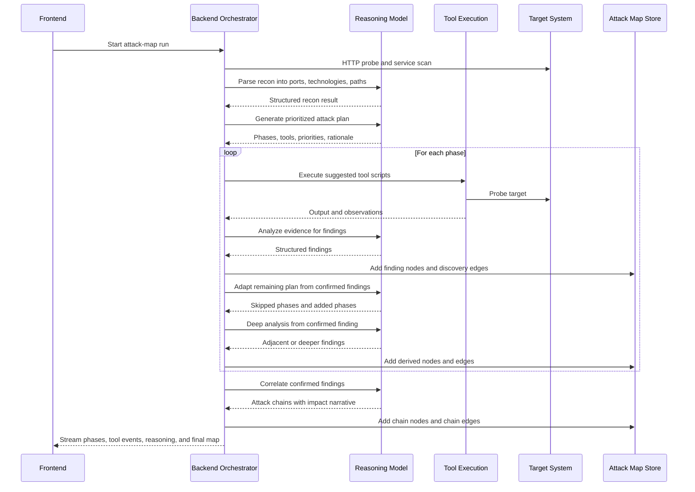
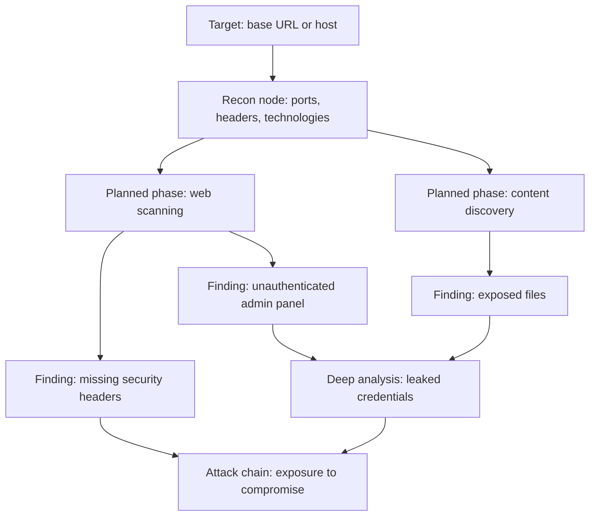
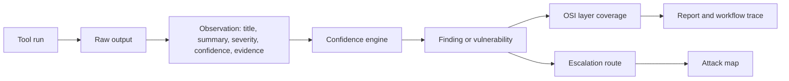

# SynoSec

SynoSec is an AI-assisted vulnerability discovery and security orchestration platform. It combines graph-reasoning agents, evidence-producing security tools, structured vulnerability reporting, and a built-in cyber range to identify weaknesses in a target system and explain how those weaknesses connect into practical attack paths.

The project is designed for authorized security testing, validation, and demonstrations. The included vulnerable target is intentionally insecure and must not be exposed to the public internet.



## Mission

SynoSec is built to reduce the gap between conventional scanner output and analyst-grade security reasoning. Instead of only reporting isolated tool findings, the platform records evidence, maps findings to system layers, correlates related weaknesses, and presents the result as an attack map that can be reviewed, reproduced, and improved.

The core objective is to answer four questions for a target system:

1. What reachable services, technologies, paths, and trust boundaries exist?
2. Which security weaknesses are supported by concrete tool evidence?
3. Which OSI layers were covered, partially covered, or not covered?
4. Which findings can be combined into higher-impact escalation routes?

## Sophistication Roadmap Implementation

All pillars of the sophistication roadmap have been implemented to enhance trust, coverage, and scale.

### Stage 1: Trust Engine

The trust engine reduces false positives by enforcing rigorous validation before findings are accepted.

- **Stage 1a -- Evidence Verifier (workflow-execution.utils.ts)**: verifyFindingEvidence() inspects every finding before persistence. It checks evidence quotes for technical indicators like IPs, HTTP status codes, headers, and SQL patterns. Pure speculation is rejected; vague evidence is demoted to suspected status.
- **Stage 1b -- Active Replay (replay-scheduler.ts)**: When a finding reaches single_source status, the broker automatically schedules a replay of the exact tool and arguments. Confirmed replays promote findings to cross_validated status, while contradictions result in a demotion to suspected.
- **Stage 1c -- Tiered Finding Badges (workflow-trace-section.tsx)**: Findings are displayed with validation tier badges: Tool-backed (green), Suspected (amber), or Unverified (gray).

### Stage 2: Advanced Vulnerability Coverage

Coverage has been extended beyond basic web vulnerabilities to include infrastructure and authentication layers.

- **Stage 2a -- Real Tool Wrappers**: Placeholder scripts have been replaced with real execution wrappers for nuclei, sqlmap, ffuf, katana, and nmap, allowing for structured tool runs and observations.
- **Stage 2b -- Network Trust Boundary Analysis**: Topology is a first-class tool category for L3/L4/L6 modeling. Tools like Network Segment Map, Service Fingerprint, and TLS Audit build network models to unlock coverage in lower OSI layers.
- **Stage 2c -- Session and Auth Layer Tools**: New L5 tools include JWT Analyzer for offline token inspection and Auth Flow Probe for testing rate limiting and user enumeration on authentication endpoints.
- **Stage 2d -- MITRE ATT&CK Tagging**: Findings are automatically enriched with CWE IDs, MITRE ATT&CK IDs, and tactic tags using a local enrichment mapper.

### Stage 3: Enterprise Scale

The platform now supports multi-host environment modeling and lateral movement analysis.

- **Stage 3 -- Enterprise Environment Graphs**: Scans support named environments with host, subnet, and service nodes. The orchestrator generates environment graphs and coordinates multi-host plans. Explicit lateral_movement edges link credential or session findings across compatible authentication surfaces.

### Stage 4: AI-Native Sophistication

AI agents have been upgraded for adversarial verification and adaptive planning.

- **Stage 4a -- Adversarial Verifier (orchestrator-execution-service.ts)**: adversarialVerifyFinding() challenges derived findings by attempting to find reasons for rejection. Findings that fail this adversarial check are dropped.
- **Stage 4b -- Adaptive Attack Plan (orchestrator-execution-service.ts)**: The orchestrator re-enters planning after each phase, allowing the model to skip unnecessary steps or add new phases based on confirmed evidence.
- **Stage 4c -- Cross-Scan Pattern Learning (pattern-learning.ts)**: Execution reports and verifier outcomes are aggregated into learning snapshots. The tool selector uses these patterns to promote historically reliable tools and penalize noisy combinations.

## System Architecture

SynoSec is organized as a distributed control plane with local or connector-based execution. The backend coordinates agents, providers, tool policies, tool execution, scan state, and attack-map persistence. The frontend presents workflow traces, tool results, coverage, and graph relationships.



### Main Components

- `apps/frontend`: React and Tailwind interface for targets, agents, tools, workflows, execution reports, and the attack map.
- `apps/backend`: Express API, scan orchestration, workflow execution, AI-provider integration, tool brokerage, scan storage, and attack-chain correlation.
- `apps/connector`: Worker process for executing tool jobs from a different network position than the backend.
- `packages/contracts`: Shared TypeScript contracts and Zod schemas for scans, vulnerabilities, OSI coverage, tool runs, observations, workflow events, reports, and escalation routes.
- `scripts/tools`: Bash-backed tool implementations used by the broker and seeded AI-tool definitions.
- `demos/vulnerable-app`: Controlled vulnerable target used as the cyber range for safe validation.

## Vulnerability Discovery Method

SynoSec uses a closed-loop methodology: observe the target, reason over the current graph, choose evidence-producing tools, validate tool output, and update the graph. The system is intentionally evidence-oriented. A vulnerability is not just a model assertion; it must be represented as a structured record with target details, severity, confidence, technique, recommendation, and evidence references.



The current execution path is the attack-map orchestrator.

### Attack-Map Orchestrator

The attack-map path focuses on graph construction and relationship analysis. It performs initial reconnaissance, asks the model to build an attack plan, executes mapped tools for each phase, extracts findings, adapts the remaining plan from confirmed evidence, performs deep analysis from confirmed findings, and then correlates multi-finding attack chains.



## Graph-Reasoning Agents

SynoSec treats a scan as a reasoning graph rather than a flat list of scanner results. Graph nodes represent targets, tactics, findings, and chains. Edges represent discovery relationships or chain relationships. This allows the system to preserve how a result was reached, what evidence supports it, and how one weakness enables another.



Graph reasoning is used in three ways:

- Prioritization: The agent selects the next tool or phase based on current coverage, previously executed tools, observed services, and risk.
- Expansion: Confirmed findings become new reasoning anchors for deeper or adjacent checks, such as privilege escalation, lateral movement, or exposed secrets.
- Correlation: Multiple findings are evaluated together to identify escalation routes that have higher impact than any individual finding.

## Evidence and Validation Model

SynoSec separates raw tool execution from security conclusions. Tool output is converted into observations. Observations can become findings. Findings can become structured vulnerabilities or graph nodes. Chain analysis links findings only when there is a plausible enabling relationship.



## OSI-Layer Coverage

SynoSec models security coverage across L1 through L7:

| Layer | Name | Example evidence in SynoSec |
| --- | --- | --- |
| L1 | Physical | Simulated host-level leakage or mounted host artifacts in cyber range scenarios |
| L2 | Data Link | Docker bridge or local-link exposure checks in controlled environments |
| L3 | Network | Reachable hosts, segmentation gaps, ICMP behavior, network mapping |
| L4 | Transport | Open ports, exposed services, plaintext transport, unexpected listeners |
| L5 | Session | Token expiry, replay, session fixation, cookie or JWT lifecycle issues |
| L6 | Presentation | Encoding, content type handling, weak cryptographic presentation, parser issues |
| L7 | Application | Authentication bypass, injection, BOLA, XSS, exposed admin routes, sensitive data exposure |

## Cyber Range Evaluation

The repository includes a safe target under demos/vulnerable-app. It is an intentionally vulnerable Express application that exposes realistic web weaknesses for controlled testing:

- SQL injection simulation in /login.
- Unauthenticated administrator panel at /admin.
- Verbose debug output and internal service hints.
- Missing security headers.
- Exposed framework and server headers.
- Sensitive user data from /api/users.
- Directory listing simulation at /files.
- Reflected XSS simulation at /search.

## Getting Started

### Prerequisites

- Docker and Docker Compose
- Node.js 20 or newer
- pnpm
- Optional Anthropic API key for hosted high-reasoning agents
- Optional local model runtime for local-provider execution

### Quick Start with Docker

```bash
cp .env.example .env
make docker-up
```

### Local Development

```bash
pnpm install
make dev
```

### Endpoints

| Service | Default URL |
| --- | --- |
| Frontend | http://localhost:5173 |
| Backend API | http://localhost:3001 |
| Vulnerable target | http://localhost:8888 |
| Ollama, when enabled | http://localhost:11434 |

### Common Commands

```bash
make docker-up                # Start the Docker Compose stack
make docker-down              # Stop and remove Docker services
make dev                      # Start host-mode development
make smoke-seeded-sandbox     # Run the seeded connector sandbox smoke validation
make test                     # Run workspace tests
pnpm build                    # Build all workspace packages
```

## Repository Structure

```text
apps/
  backend/       API, orchestration, agents, tools, scan services
  connector/     Remote or isolated tool execution worker
  frontend/      Dashboard, workflow traces, attack-map views
packages/
  contracts/     Shared schemas and types
scripts/
  tools/         Bash tool implementations
demos/
  vulnerable-app/ Controlled vulnerable target for evaluation
docs/
  *.md           Requirements, decisions, terminology, and feature notes
```

## Tool Platform Architecture

The tool platform is designed so the repo can grow from a handful of demo tools to hundreds of cataloged tools without turning the scan loop, seed data, or UI into a maintenance bottleneck.

### Phase 1: Modular Tool Catalog

The canonical catalog lives under apps/backend/src/workflow-engine/tools/catalog/. Every entry includes metadata for phase, osiLayers, and tags.

### Phase 2: Modular Seed Architecture

Seeded tools are split into shell assets in scripts/tools/ and per-tool seed modules in apps/backend/prisma/seed-data/tools/.

### Phase 3: Tool Selector Layer

The tool selector scores available tools based on layer alignment, phase progression, risk tier, and recency, preventing the model from being overwhelmed by too many tools in a single call.

### Phase 4: Smart Agent-Tool Assignment

Agent-tool auto-assignment is opt-in and uses policies to automatically add policy-matched tools to agents based on catalog metadata.

## Security and Usage Boundaries

SynoSec is for authorized security assessment and controlled cyber range evaluation. Do not point active or controlled-exploit tools at systems you do not own or have explicit permission to test. The demo vulnerable application is deliberately insecure and should only run in an isolated development or evaluation environment.
