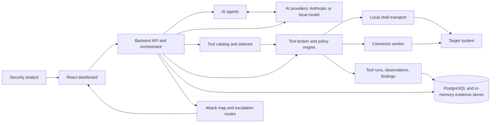
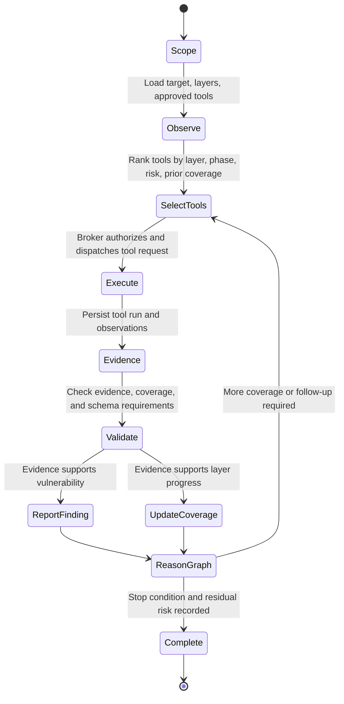
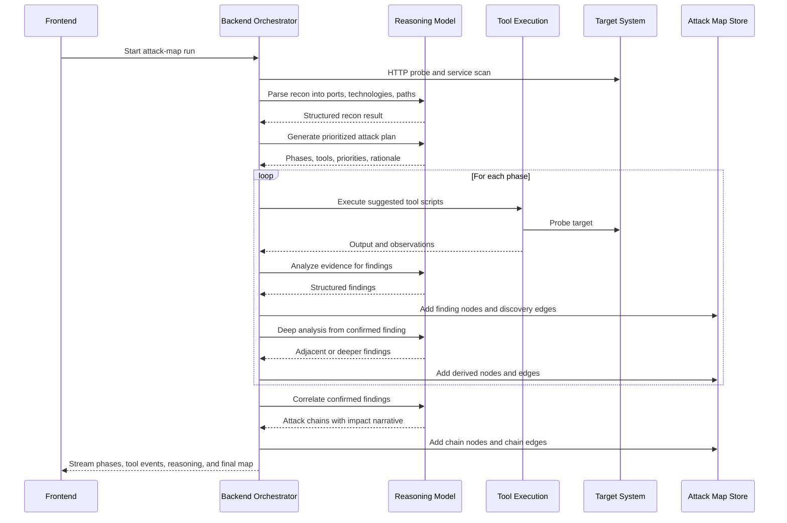
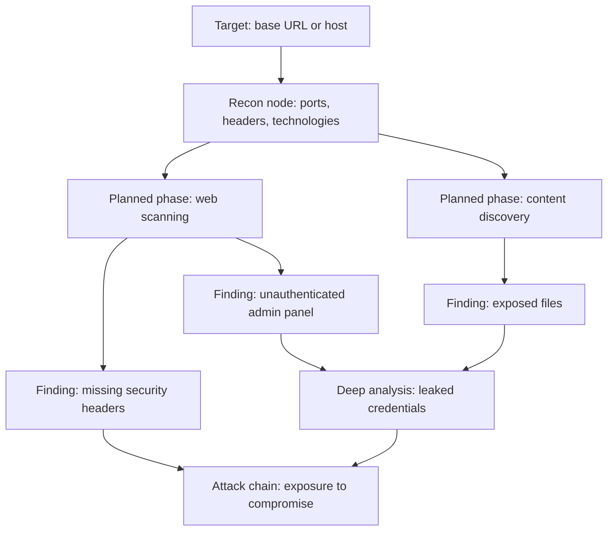
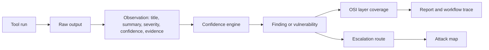

# SynoSec

SynoSec is an AI-assisted vulnerability discovery and security orchestration platform. It combines graph-reasoning agents, evidence-producing security tools, structured vulnerability reporting, and a built-in cyber range to identify weaknesses in a target system and explain how those weaknesses connect into practical attack paths.

The project is designed for authorized security testing, validation, and demonstrations. The included vulnerable target is intentionally insecure and must not be exposed to the public internet.


## Mission

SynoSec is built to reduce the gap between conventional scanner output and analyst-grade security reasoning. Instead of only reporting isolated tool findings, the platform records evidence, maps findings to system layers, correlates related weaknesses, and presents the result as an attack map that can be reviewed, reproduced, and improved.

The core objective is to answer four questions for a target system:

1. What reachable services, technologies, paths, and trust boundaries exist?
2. Which security weaknesses are supported by concrete tool evidence?
3. Which OSI layers were covered, partially covered, or not covered?
4. Which findings can be combined into higher-impact escalation routes?

## System Architecture

SynoSec is organized as a distributed control plane with local or connector-based execution. The backend coordinates agents, providers, tool policies, tool execution, scan state, and attack-map persistence. The frontend presents workflow traces, tool results, coverage, and graph relationships.




### Main Components

- `apps/frontend`: React and Tailwind interface for applications, agents, tools, workflows, runtimes, scan traces, and the attack map.
- `apps/backend`: Express API, scan orchestration, workflow execution, AI-provider integration, tool brokerage, scan storage, and attack-chain correlation.
- `apps/connector`: Worker process for executing tool jobs from a different network position than the backend.
- `packages/contracts`: Shared TypeScript contracts and Zod schemas for scans, vulnerabilities, OSI coverage, tool runs, observations, workflow events, reports, and escalation routes.
- `scripts/tools`: Bash-backed tool implementations used by the broker and seeded AI-tool definitions.
- `demos/vulnerable-app`: Controlled vulnerable target used as the cyber range for safe validation.

## Vulnerability Discovery Method

SynoSec uses a closed-loop methodology: observe the target, reason over the current graph, choose evidence-producing tools, validate tool output, and update the graph. The system is intentionally evidence-oriented. A vulnerability is not just a model assertion; it must be represented as a structured record with target details, severity, confidence, technique, recommendation, and evidence references.



The discovery method has two complementary execution paths.

### Single-Agent Defensive Loop

The single-agent scan path focuses on layer-aware vulnerability discovery. It creates a scan, initializes requested OSI-layer coverage, loads the approved agent tools, and asks the selected model to act through constrained tool calls.

The agent can perform four structured actions:

- `call_tool`: Execute one approved tool against a normalized target.
- `report_vulnerability`: Persist one evidence-backed vulnerability.
- `update_layer_coverage`: Mark a layer as covered, partially covered, or not covered, with evidence and gaps.
- `submit_scan_completion`: Close the scan with a summary, residual risk, next step, and stop reason.

For hosted models, SynoSec exposes these actions as tool calls through the AI SDK. For local models, the same behavior is represented as strict JSON actions. In both modes, the backend validates the action schema and rejects unsupported actions, unknown tools, invalid coverage references, or missing completion payloads.

### Attack-Map Orchestrator

The attack-map path focuses on graph construction and relationship analysis. It performs initial reconnaissance, asks the model to build an attack plan, executes mapped tools for each phase, extracts findings, performs deep analysis from confirmed findings, and then correlates multi-finding attack chains.



## Graph-Reasoning Agents

SynoSec treats a scan as a reasoning graph rather than a flat list of scanner results. Graph nodes represent targets, tactics, findings, and chains. Edges represent discovery relationships or chain relationships. This allows the system to preserve how a result was reached, what evidence supports it, and how one weakness enables another.



Graph reasoning is used in three ways:

- Prioritization: The agent selects the next tool or phase based on current coverage, previously executed tools, observed services, and risk.
- Expansion: Confirmed findings become new reasoning anchors for deeper or adjacent checks, such as privilege escalation, lateral movement, or exposed secrets.
- Correlation: Multiple findings are evaluated together to identify escalation routes that have higher impact than any individual finding.

The resulting attack map is not only a visualization layer. It is the working memory of the scan: a reviewable model of what was observed, what was inferred, and what relationships were established.

## Evidence and Validation Model

SynoSec separates raw tool execution from security conclusions. Tool output is converted into observations. Observations can become findings. Findings can become structured vulnerabilities or graph nodes. Chain analysis links findings only when there is a plausible enabling relationship.



Important validation properties:

- Tool requests are authorized by policy before execution.
- Tool runs record status, exit code, output, command preview, dispatch mode, and failure reason.
- Observations include a source tool, target, evidence, technique, confidence, and severity.
- Vulnerability submissions require evidence, impact, recommendation, target metadata, confidence, and validation status.
- Layer coverage records include tool references, evidence references, vulnerability references, and explicit gaps.
- Corroborating observations are aggregated by the confidence engine using `1 - (1 - A)(1 - B)`, which increases confidence when independent evidence supports the same hypothesis.

## Tool Selection and Execution

Tools are defined with category, risk tier, execution phase, OSI-layer metadata, tags, input schema, and script implementation. The selector ranks tools from the approved agent set using:

- Layer alignment with requested but uncovered OSI layers.
- Phase progression from early reconnaissance to late validation.
- Risk gating for passive, active, and controlled-exploit tools.
- Recency penalties so the loop does not repeatedly choose the same tool without new justification.
- Category diversity so selected tools do not collapse into one narrow class.

The broker then compiles the tool definition into a concrete request, checks policy, dispatches it locally or through a connector, stores the result, and emits workflow events. Tool failures are recorded with original failure context so operators can inspect what failed instead of receiving an artificial success.

## OSI-Layer Coverage

SynoSec models security coverage across `L1` through `L7`:

| Layer | Name | Example evidence in SynoSec |
| --- | --- | --- |
| `L1` | Physical | Simulated host-level leakage or mounted host artifacts in cyber range scenarios |
| `L2` | Data Link | Docker bridge or local-link exposure checks in controlled environments |
| `L3` | Network | Reachable hosts, segmentation gaps, ICMP behavior, network mapping |
| `L4` | Transport | Open ports, exposed services, plaintext transport, unexpected listeners |
| `L5` | Session | Token expiry, replay, session fixation, cookie or JWT lifecycle issues |
| `L6` | Presentation | Encoding, content type handling, weak cryptographic presentation, parser issues |
| `L7` | Application | Authentication bypass, injection, BOLA, XSS, exposed admin routes, sensitive data exposure |

Coverage is recorded as `covered`, `partially_covered`, or `not_covered`. A layer can remain partially covered when a tool produced useful evidence but the agent still reports gaps, uncertainty, blocked checks, or missing validation.

## Cyber Range Evaluation

The repository includes a safe target under `demos/vulnerable-app`. It is an intentionally vulnerable Express application that exposes realistic web weaknesses for controlled testing:

- SQL injection simulation in `/login`.
- Unauthenticated administrator panel at `/admin`.
- Verbose debug output and internal service hints.
- Missing security headers.
- Exposed framework and server headers.
- Sensitive user data from `/api/users`.
- Directory listing simulation at `/files`.
- Reflected XSS simulation at `/search`.

The cyber range exists to evaluate whether the agents can move from reconnaissance to evidence-backed conclusions without touching a real third-party system.


Evaluation focuses on:

- Discovery accuracy: Whether open ports, services, headers, and known paths are detected.
- Evidence quality: Whether findings cite concrete output rather than unsupported model claims.
- Coverage quality: Whether each requested layer has an explicit status and gap statement.
- Graph quality: Whether related findings are connected into plausible discovery or chain relationships.
- Failure transparency: Whether failed tools and incomplete checks remain visible in traces and reports.

## Data Flow

At runtime, a typical vulnerability discovery pass follows this path:

1. The analyst defines an application, runtime, agent, target scope, requested OSI layers, and exploit allowance.
2. The backend creates a scan and root tactic node.
3. The tool selector ranks approved tools for the current layer coverage and scan phase.
4. The agent requests a tool or the orchestrator executes a planned phase.
5. The broker authorizes the request and dispatches it locally or through a connector.
6. Tool output is persisted as a tool run and normalized into observations.
7. The agent or orchestrator analyzes the evidence and submits vulnerabilities, coverage updates, or graph findings.
8. Confirmed findings are used as anchors for deeper reasoning and chain correlation.
9. Reports, traces, coverage, and the attack map are exposed to the frontend.

## Getting Started

### Prerequisites

- Docker and Docker Compose
- Node.js 20 or newer
- `pnpm`
- Optional Anthropic API key for hosted high-reasoning agents
- Optional local model runtime for local-provider execution

### Quick Start with Docker

```bash
cp .env.example .env
make docker-up
make smoke-e2e
```

### Local Development

```bash
pnpm install
make dev
```

Local development starts Postgres, the vulnerable target, and the host-mode backend and frontend. Attack-map and scan execution should be started from the UI rather than as an automatic background action during development startup.

To use local inference, configure the local provider settings in `.env` and ensure the configured base URL is reachable by the backend. When `LOCAL_ENABLED=TRUE`, the Docker-backed development path can start Ollama and prepare the configured local model.

### Endpoints

| Service | Default URL |
| --- | --- |
| Frontend | `http://localhost:5173` |
| Backend API | `http://localhost:3001` |
| Vulnerable target | `http://localhost:8888` |
| Ollama, when enabled | `http://localhost:11434` |

### Common Commands

```bash
make docker-up       # Start the Docker Compose stack
make docker-down     # Stop and remove Docker services
make dev             # Start host-mode development
make smoke-e2e       # Run the Docker smoke evaluation
make test            # Run workspace tests
pnpm build           # Build all workspace packages
```

To fully stop local development services and free the default ports:

```bash
make docker-down
make free-dev-ports
```

### Authentication

Optional app-user authentication is controlled by `AUTH_ENABLED`. When it is enabled, configure the Google client ID, allowed emails, session secret, cookie settings, and frontend URL in `.env`. Google Identity Services redirect mode posts the returned ID token to `/api/auth/google`; the backend verifies the token, creates the SynoSec session cookie, and redirects the browser back into the application.

`AUTH_ALLOWED_EMAILS` is enforced on authenticated requests, so removing an address from the allowlist prevents continued access on the next session-backed call.

### Connector Execution

The connector path lets SynoSec execute broker-approved tool jobs from another network position. This is useful for VPS deployments, segmented test networks, or cyber range layouts where the backend should not execute probes directly.

Key settings:

- `TOOL_EXECUTION_MODE=connector` routes broker-approved tool runs through the connector control plane.
- `CONNECTOR_RUN_MODE` supports dry-run, simulation, and execution modes.
- `POST /api/connectors/test-dispatch` can validate broker-to-connector dispatch without starting a full scan.

### Production Deployment

The production stack is defined in `docker-compose.vps.yml` and is intended to run behind host-level nginx. The VPS deployment model uses Dockerized backend, frontend, connector, and Postgres services, with nginx terminating TLS and forwarding traffic to loopback-bound frontend and backend ports.

Required deployment configuration includes:

- VPS host, user, SSH key, and app directory permissions.
- Public frontend URL and nginx server name.
- Postgres password, connector shared token, and AI-provider credentials.
- Authentication secrets when `AUTH_ENABLED=true`.

Most non-secret VPS defaults should live in the committed deployment environment template rather than being duplicated as ad hoc CI variables.

## Repository Structure

```text
apps/
  backend/       API, orchestration, agents, tools, scan services
  connector/     Remote or isolated tool execution worker
  frontend/      Dashboard, workflow traces, attack-map views
packages/
  contracts/     Shared schemas and types
scripts/
  tools/         Bash tool implementations
demos/
  vulnerable-app/ Controlled vulnerable target for evaluation
docs/
  *.md           Requirements, decisions, terminology, and feature notes
```

## Feature and Design Documentation

Additional project notes live under `docs/`:

- `docs/features.md`: Active feature inventory and extension guidance.
- `docs/requirements.md`: Security-stack and coverage requirements.
- `docs/defensive-loop-contract.md`: Defensive-loop behavior and contracts.
- `docs/strategy-flow-terminology.md`: Naming conventions for strategy maps, tactics, and escalation routes.
- `docs/vulnerable-app-specification.md`: Cyber range concept and intended vulnerability coverage.

## Security and Usage Boundaries

SynoSec is for authorized security assessment and controlled cyber range evaluation. Do not point active or controlled-exploit tools at systems you do not own or have explicit permission to test. The demo vulnerable application is deliberately insecure and should only run in an isolated development or evaluation environment.

## Contributing Tools

New tool integrations should be added as auditable, policy-aware capabilities:

1. Define the tool metadata and OSI-layer mapping in the catalog or seed data.
2. Implement the script under `scripts/tools`.
3. Ensure the tool returns structured observations where possible.
4. Add or update tests for compilation, selection, and execution behavior.
5. Verify behavior against the cyber range before relying on it for demonstrations.
