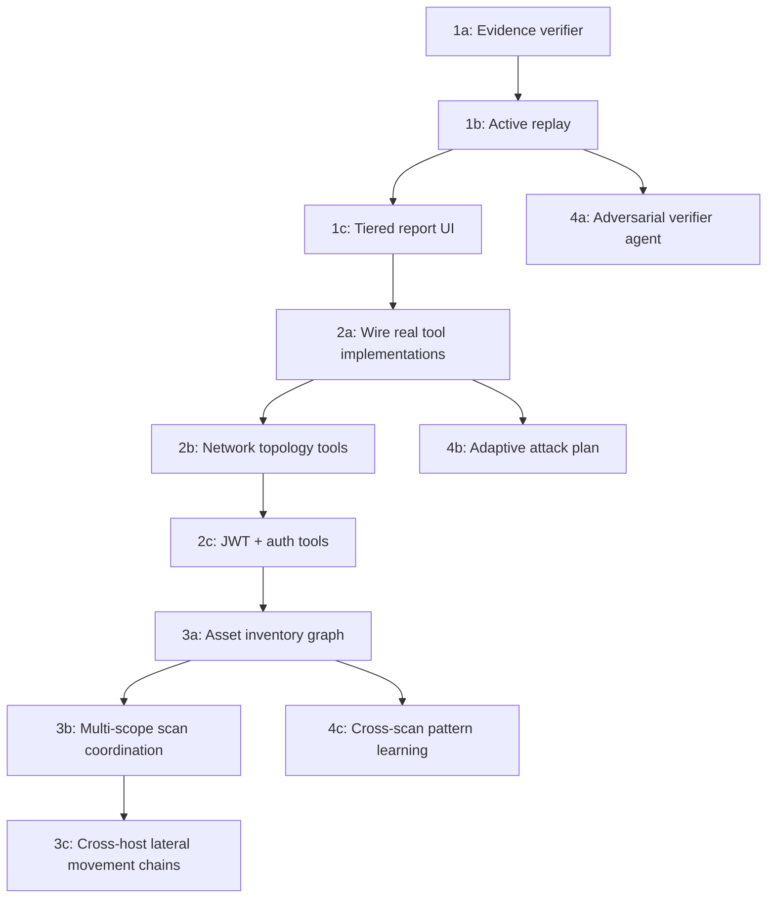

# SynoSec: Sophistication Roadmap

## Context

SynoSec is a graph-reasoning security platform that already does something meaningfully different from conventional scanners: it requires tool-backed evidence for every finding, maps relationships between findings, and models OSI-layer coverage. The architecture (broker, connector, confidence engine, attack-map graph) is the right skeleton.

The user's two-part problem is:
1. False positives reduce trust — findings are claimed without being rigorously verified or reproduced
2. Coverage stops at shallow L7 web findings — the platform cannot yet find advanced, multi-step, or multi-host vulnerabilities relevant to large organizations

This plan does not propose adding more tools. It proposes upgrading the quality of reasoning, the depth of verification, and the breadth of environment modeling — all grounded in what already exists in the codebase.

---

## Current Strengths to Preserve

- `packages/contracts/src/scan-core.ts`: `securityValidationStatusSchema` already has `unverified → suspected → single_source → cross_validated → reproduced → rejected`. This is the right ladder; it is just not enforced end-to-end.
- `1 - (1-A)(1-B)` confidence aggregation already exists in the observation layer.
- `cwe`, `owasp`, `mitreId`, `technique`, `reproduction.steps` fields already exist in vulnerability schemas.
- `tool-selector.ts` pre-filters tools by layer, phase, risk tier, and recency. This is where sophistication lives.
- The attack-map orchestrator already builds a graph of findings and chains them.

---

## The Four Pillars

```ascii
┌──────────────────────────────────────────────────────────────┐
│                  SynoSec Sophistication Model                │
├────────────────┬──────────────────┬──────────────┬──────────┤
│  1. TRUST      │ 2. ADVANCED      │ 3. ENTERPRISE│ 4. AI    │
│  ENGINE        │ COVERAGE         │ SCALE        │ UPGRADE  │
│                │                  │              │          │
│ Stop reporting │ Go beyond basic  │ Model the    │ Adversar-│
│ things that    │ L7 web vulns     │ whole env,   │ ial verif│
│ are not real   │                  │ not 1 host   │ + adapt. │
└────────────────┴──────────────────┴──────────────┴──────────┘
```

---

## Pillar 1: Trust Engine (False Positive Reduction)

**The core problem:** The model observes something in tool output and asserts a finding. Nothing currently forces the system to prove the claim is real before persisting it and showing it to the analyst.

### 1a. Mandatory Evidence Verifier (before persistence)

Intercept every `report_vulnerability` and `report_finding` action in the workflow execution service (`apps/backend/src/engine/workflow/workflow-execution.service.ts`) and run it through a structured verifier before the finding is accepted.

The verifier checks three things:
1. Quote match: does the `evidence.quote` actually appear verbatim in the referenced tool run output? If not, the finding is `rejected`.
2. Specificity: is the evidence specific (contains a URL, payload, response line, port, or header name)? Generic claims like "SQL injection may be possible" without a concrete indicator are demoted to `suspected`, not `single_source`.
3. Technique alignment: does the claimed technique match the tool that produced the evidence? (e.g., an http-headers tool cannot produce SQL injection evidence)

Implementation: add `verifyFindingEvidence(finding, toolRun)` in `apps/backend/src/engine/workflow/workflow-execution.utils.ts`. Reject or demote before the finding reaches the scan store.

### 1b. Active Replay for Promoted Findings

When a finding reaches `single_source` status, schedule an automatic replay of the exact tool + arguments that produced it. Store the replay result as a second tool run attached to the same finding.

- If replay confirms: promote to `cross_validated`
- If replay fails or contradicts: demote to `suspected`, flag for human review
- If replay is blocked (rate limit, time budget): keep `single_source`, mark `replay_pending`

This closes the gap between "tool ran and said something" and "tool ran twice and said the same thing." Implement replay scheduling in `apps/backend/src/engine/workflow/broker/`.

### 1c. Graduated Report Tiers

Change the frontend report to show findings in three tiers:

| Tier | Status | What it means |
|------|--------|---------------|
| Confirmed | `cross_validated` or `reproduced` | Two independent confirmations. Show prominently. |
| Suspected | `single_source` or `suspected` | One tool said so. Show with explicit caveat. |
| Informational | `unverified` | Model observation, no tool evidence yet. Hidden by default, available on request. |

This alone will dramatically improve analyst trust without changing how findings are discovered.

**Critical files:**
- `packages/contracts/src/scan-core.ts` — add `replay_pending` to `securityValidationStatusSchema`
- `apps/backend/src/engine/workflow/workflow-execution.utils.ts` — add verifier function
- `apps/backend/src/engine/scans/scan-store.ts` — add replay scheduling
- `apps/frontend/src/features/workflows/` — tiered report display

---

## Pillar 2: Advanced Vulnerability Coverage

**The core problem:** Current coverage is L7 web-basics. Real enterprise environments have infrastructure weaknesses that are more serious and more common at L3-L6.

### 2a. Make the Installed Tools Work for Real

`docs/features.md` is explicit: the binaries `httpx`, `katana`, `nuclei`, `ffuf`, `nmap`, and `sqlmap` are already installed on the worker. But the seeded tool records in `apps/backend/prisma/seed-data/ai-builder-defaults.ts` still use `createBinaryMissingScript(...)` placeholders for 5 tools.

Priority 1: replace placeholder bash in the following seed modules with real execution wrappers (the scripts go in `scripts/tools/`):
- `seed-web-crawl` → `scripts/tools/web/web-crawl.sh` (run `katana`)
- `seed-service-scan` → `scripts/tools/network/service-scan.sh` (run `nmap -sV`)
- `seed-content-discovery` → `scripts/tools/content/content-discovery.sh` (run `ffuf`)
- `seed-vuln-audit` → `scripts/tools/web/vulnerability-audit.sh` (run `nuclei`)
- `seed-sql-injection-check` → `scripts/tools/web/sql-injection-check.sh` (run `sqlmap`)

These five tool upgrades are the highest-leverage change available because the infrastructure already supports them.

### 2b. Network Trust Boundary Analysis (L3)

Add a new tool category: **topology**. These tools do not scan for vulnerabilities directly — they build a model of the network structure so the agent knows what is reachable from where.

New tools to add:
- `network-segment-map`: Discover adjacent hosts and subnets using `nmap` host discovery. Output: list of live hosts, inferred subnets, open gateway ports.
- `service-fingerprint`: Deep service version detection with CPE (Common Platform Enumeration) output for CVE correlation.
- `tls-audit`: TLS/SSL configuration check against a target host:port. Check for weak ciphers, expired certs, BEAST/POODLE/DROWN, self-signed certificates.

These tools unlock L3-L4 coverage that is currently marked `not_covered` in almost every scan.

### 2c. Session and Auth Layer (L5)

Add tools:
- `jwt-analyzer`: Detect `alg:none`, weak secrets, or missing claims in JWT tokens found in responses. Input: token string extracted from earlier tool output.
- `auth-flow-probe`: Test authentication endpoints for: missing rate limiting, credential stuffing response differences (timing oracle), password policy enforcement. Input: login endpoint URL.

### 2d. MITRE ATT&CK Tagging

The `techniqueNodeSchema` in `packages/contracts/src/scan-core.ts` already has `mitreId`. But it is not populated automatically.

Add an ATT&CK tag mapper: when the agent submits a `report_vulnerability`, the system looks up the `technique` field against a local ATT&CK technique index and auto-populates `cwe` and a suggested `mitreId`. This is a simple lookup table seeded in the database.

The attack-map orchestrator can then show ATT&CK tactic coverage (Reconnaissance → Initial Access → Execution → Persistence → …) as a second coverage dimension alongside OSI layers.

---

## Pillar 3: Enterprise Scale (Multi-Host Environment Modeling)

**The core problem:** SynoSec scans one target. Real enterprise environments are dozens to hundreds of hosts, segmented networks, and trust relationships between systems. A weakness in host A is only interesting if it can be combined with a weakness in host B.

### 3a. Asset Inventory as a First-Class Graph

Before scanning, introduce an **asset discovery phase** that runs first for any multi-host scope. Output: an environment graph stored in the database with nodes for hosts, services, and subnets, and edges for network reachability.

Schema additions to `packages/contracts/src/scan-core.ts`:
```ts
assetNodeSchema = { id, host, type: "host"|"service"|"subnet", discoveredAt, metadata }
assetEdgeSchema = { from, to, edgeType: "reaches"|"trusts"|"hosts", evidence }
```

The agent then uses this graph as context for every scan decision: "what else is reachable from this host, and does what I found here matter there?"

### 3b. Multi-Scope Scan Coordination

Extend `scanScopeSchema.targets` (currently max 20) to support a named environment rather than a flat list of URLs. An environment is:
- A set of discovered or declared host IPs/ranges
- A set of declared trust zones (DMZ, internal, admin)
- Connectivity assertions (host A can reach host B on port 443)

The orchestrator spawns one workflow per in-scope host and aggregates findings into a shared environment-level attack map. The connector model already supports parallel execution from different network positions — this is the multi-host use case.

### 3c. Cross-Host Lateral Movement Chains

The current escalation route model links findings within one scan. Extend it to link findings across hosts.

When the orchestrator finds:
- `Host A`: valid credentials or session token
- `Host B`: uses same authentication mechanism

...it generates a cross-host escalation route with a "lateral movement" edge type.

This turns the attack map from "what's wrong with this server" into "what's the actual blast radius in this environment."

---

## Pillar 4: AI-Native Sophistication Upgrades

### 4a. Adversarial Verifier Agent

Add a second model invocation whose sole job is to find reasons to reject or downgrade a proposed finding. This is the "red team vs. blue team" pattern applied within the platform itself.

Before a finding is promoted from `single_source` to `cross_validated`, the verifier agent is given:
- The finding claim
- The raw tool output
- The target context

Its task is: "Give me three reasons this finding might be a false positive." If all three are weak, the finding is promoted. If any is strong, the finding is flagged for human review.

Implementation: a new `verifier-agent` role in `apps/backend/src/engine/orchestrator/orchestrator-execution-service.ts`, invoked after each deep-analysis phase.

### 4b. Adaptive Attack Plan

The current orchestrator generates an attack plan once at the start and executes it. Confirmed findings should reshape the plan.

After each phase completes, feed the confirmed findings back to the reasoning model with the question: "Given what we now know, which planned phases can be skipped, and which new phases should be added?"

This is a small prompt change to the orchestrator loop in `orchestrator-execution-service.ts` but dramatically changes the intelligence of the scan — it stops being a fixed checklist and starts being a genuine reasoning loop.

### 4c. Cross-Scan Pattern Learning

Build an aggregation layer that, across all completed scans, tracks:
- Which tool + target type combinations produce high-confidence findings
- Which model assertions get promoted vs. rejected through the verifier
- Which escalation routes proved to be real vs. false

This becomes a bias input to the tool selector (`apps/backend/src/engine/scans/runtime/tool-selector.ts`): if `nuclei` on Express apps has a 90% confirmation rate for certain template categories, weight it higher. If `nikto` on the same target type has a 30% false positive rate, penalize it.

---

## Implementation Order

The pillars are not equal in urgency. False positive reduction is the precondition for everything else — more coverage is worthless if analysts don't trust the output.



**Stage 1 — Trust (COMPLETED):** 1a → 1b → 1c  
**Stage 2 — Coverage (COMPLETED):** 2a → 2b → 2c → 2d  
**Stage 3 — Scale (COMPLETED):** 3a → 3b → 3c  
**Stage 4 — AI upgrade (COMPLETED):** 4a → 4b → 4c

---

## Key Files for Each Change

| Change | Files |
|--------|-------|
| Evidence verifier | `packages/contracts/src/scan-core.ts`, `apps/backend/src/engine/workflow/workflow-execution.utils.ts` |
| Active replay | `apps/backend/src/engine/workflow/broker/`, `apps/backend/src/engine/scans/scan-store.ts` |
| Tiered report UI | `apps/frontend/src/features/workflows/` |
| Wire real tools | `apps/backend/prisma/seed-data/ai-builder-defaults.ts`, `scripts/tools/web/`, `scripts/tools/network/` |
| New topology tools | `apps/backend/src/engine/tools/catalog/network.ts`, `scripts/tools/network/` |
| JWT/auth tools | `apps/backend/src/engine/tools/catalog/web.ts`, `scripts/tools/web/` |
| Asset graph schema | `packages/contracts/src/scan-core.ts`, `apps/backend/prisma/schema.prisma` |
| Multi-scope coord. | `apps/backend/src/engine/orchestrator/orchestrator-execution-service.ts` |
| Adversarial verifier | `apps/backend/src/engine/orchestrator/orchestrator-execution-service.ts` |
| Adaptive attack plan | `apps/backend/src/engine/orchestrator/orchestrator-execution-service.ts` |

---

## Verification

After Stage 1 (Trust):
- Run the smoke evaluation against the demo vulnerable app (`make smoke-e2e`)
- Every finding reported in the UI should show a tier badge (Confirmed / Suspected / Informational)
- The SQL injection finding on `/login` should reach `cross_validated` after replay
- The missing security headers finding should be `single_source` (real but not deeply verifiable by replay)
- Zero findings should appear with no evidence quote

After Stage 2 (Coverage):
- `nuclei`, `ffuf`, `katana`, `sqlmap` should all produce real tool run output in the workflow trace (not "not implemented")
- OSI layers L4 and L6 should show `covered` or `partially_covered` for a typical target, not `not_covered`

After Stage 3 (Scale):
- A two-host test environment scan should produce an environment-level attack map with cross-host edges
- A lateral movement chain should appear when both hosts share a credential weakness
